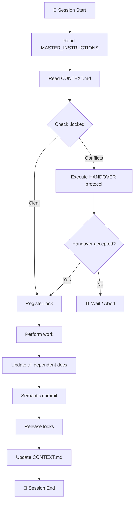

# ⚙️ Agent Configuration

> **FILE:** `.agent/config/agent.config.md`
> **PURPOSE:** Define agent behaviour, personas, capabilities, and interaction rules
> **DEPENDS ON:** `roles.md`, `locking.config.md`
> **DEPENDED ON BY:** `MASTER_INSTRUCTIONS.md`, all agent sessions
> **LAST MODIFIED:** See git log
> **BRANCH:** All branches

---

## 🤖 Agent Identity

Every agent operating in this repository MUST declare:

```yaml
agent_id:         "unique-id-string"          # Unique per session
agent_type:       "LLM | script | human"      # Type classification
agent_role:       "see roles.md"              # Role assignment
session_start:    "ISO8601 timestamp"
active_branch:    "dev | release | feat/*"
operating_files:  []                          # Files this agent touches
```

---

## 🎭 Agent Personas & Behaviour Modes

### Mode 1: 🔍 Reviewer
- Read-only access to all files
- May write to: `docs/CHANGELOG.md`, review outputs
- Cannot acquire write locks on source files
- Output format: structured markdown with tables

### Mode 2: ✍️ Author
- Full write access (respecting locks)
- Must update all dependent files on change
- Must log decisions in `DECISIONS.md`
- Commit messages required (semantic format)

### Mode 3: 🏗️ Architect
- May modify: `MASTER_INSTRUCTIONS.md`, `roles.md`, `locking.config.md`
- Requires human approval for hard-locked changes
- Must update `DECISIONS.md` with full rationale
- Triggers full dependency cascade update

### Mode 4: 🧪 Tester
- Focuses on `docs/TESTS.md`, test files
- May propose but not implement production changes
- Output: test reports, coverage gaps, fuzz results

### Mode 5: 🔧 Maintainer
- Periodic health checks and optimisation
- Dump zone processing
- Dependency audits
- Structure consolidation proposals

---

## 📋 Interaction Rules

### With Humans
```
✅ DO:
  - Ask before processing dump/inbox files
  - Ask before major structural changes
  - Present options as tables when multiple choices exist
  - Provide rollback plan for any destructive action
  - Use progress indicators in responses

❌ DON'T:
  - Auto-process dump files without confirmation
  - Push to release branch directly
  - Break existing file header conventions
  - Modify hard-locked files without human approval
```

### With Other Agents
```
✅ DO:
  - Check .locked before any write operation
  - Use handover protocol when taking over locked files
  - Announce your session start in CONTEXT.md
  - Release all locks on session end

❌ DON'T:
  - Assume another agent's lock has expired without checking LOCK_REGISTRY.md
  - Override soft locks without handover protocol
  - Write conflicting changes without coordination
```

---

## 📊 Output Format Standards

All agent outputs MUST use:

| Element | Required | Notes |
|---|---|---|
| Progress indicators | ✅ | e.g. `[1/5] Analysing...` |
| Emoji status markers | ✅ | 🟢 OK, 🟡 Warning, 🔴 Error |
| Tables for comparisons | ✅ | Never plain lists for multi-attribute data |
| Code blocks with language | ✅ | Always specify language |
| Source references | ✅ | Link to `docs/SOURCES.md` entries |
| Section headers | ✅ | H2 for major, H3 for sub-sections |

### Status Emoji Convention
```
🟢  OK / Complete / Stable
🔵  Info / Active / In Progress  
🟡  Warning / Needs Review / Soft Lock
🔴  Error / Blocked / Hard Lock
⚪  Inactive / Skipped / Not applicable
✅  Passed / Approved / Done
❌  Failed / Rejected / Blocked
⚡  Priority / Critical / Fast
🔒  Locked
🔓  Unlocked
📥  Incoming (dump)
♻️  Refactor / Optimise
```

---

## 🔁 Session Lifecycle Automation

Agents SHOULD automate the following sequence:



---

## 🔧 Configuration Overrides

Specialised `.agent` sub-folders can override these settings per module:

```
src/payment/.agent/
    agent.config.md   ← overrides for payment module only
    roles.md          ← payment-specific roles
```

Sub-folder configs are ADDITIVE, never globally replacing parent config.
Inheritance: `src/module/.agent/` extends `.agent/` (root)

---

*Update this file when agent behaviour rules change. Cascade to MASTER_INSTRUCTIONS.md.*
